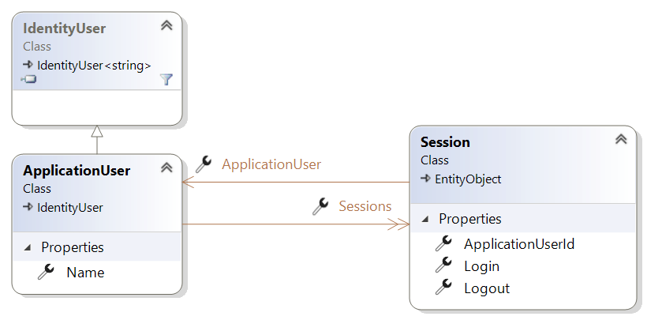
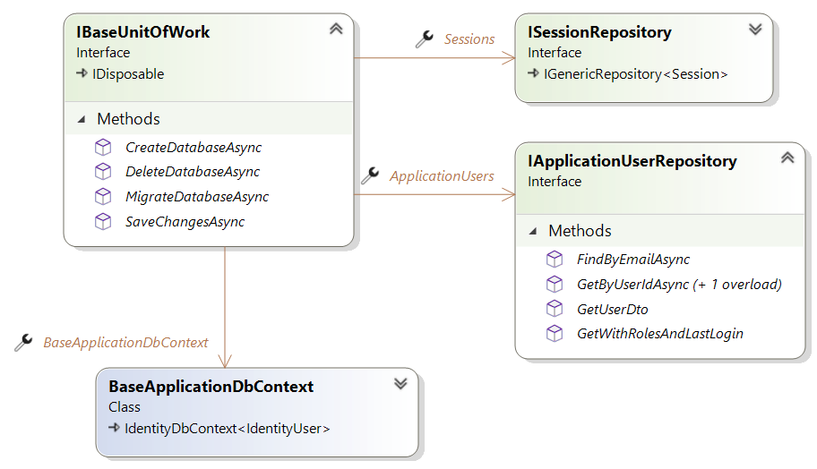

# DotNet Basis Template

Themen:
- Authentifizierung und Autorisierung (```MS Identity```)
- Persistenzschicht mit
    - Entity Framework 
    - ```MSSQLLocalDB``` für Hostentwicklung
    - UnitOfWork/Repository-Pattern
- WebApi
    - CRUD-Operationen für User- und Rollenmanagement
- Blazor Template
    - UI für SignIn / SignUp
- Serilog Logger
    - Seq Service als Datensenke

## Base (Datenbank-Anbindung)

### Base.Entities

- Definiert ```ApplicationUser``` als Ableitung von IdentityUser
- ```Session``` für Login/Logout-Handling



### Base.Persistence

- Implementierung der UnitOfWork/Repository-Interfaces, die in den Contracts definiert sind



### Persistence: Datenbank-Verbindung

- Vorerst noch die in DotNet SDK integrierte Entwicklungs-Datenbank MSSQLLocalDB in ```appsettings.json``` konfiguriert:

```json
{
  "ConnectionStrings": {
    "DefaultConnection": "Data Source=(localdb)\\MSSQLLocalDB;Initial Catalog=DotNetTemplateDb;Integrated Security=True;"
  }
}
```

### Persistence: Datenbank-Erstellung

- Persistence als Startup-Projekt
- Package Manager Console
    - Default Project: ```Persistence```
    - ```Update-Database```
- Sql Server Explorer => ```DotNetTemplateDb```

## Api

### Erster Testlauf
- Datenbank-Konfiguration in ```appsettings.json``` kontrollieren
- Projekt starten und Auth-Endpoints testen
    - VS Code Plugin ```REST Client``` installieren
    - ```api-requests.http``` für Login (Admin oder User) verwenden
    - Erzeugten token in ```@token```-Variable kopieren
    - Authorisierte Endpoints testen
    - Seq nach Log-Messages durchsuchen

### Übungen
- Verlängerung der Gültigkeit des JWT
    - => für Entwicklungsbetrieb praktisch wenn der Token nicht ausläuft
- SessionsController zur Abfrage aller Sessions
    - optional nur die offenen
    - autorisiert / nicht autorisiert
    - Sessions gruppiert nach ApplicationUserId mit eigenen Record-Dtos
    - Erweiterung api-requests.http um Logout- und Sessions-Request

## Wasm: Blazor UI

### Testlauf
- ```BaseApiUrl``` in ```appsettings.json``` kontrollieren
- Benötigt das Api-Projekt, beide Projekte müssen gestartet werden
    - Visual Studio: Solution => Set Startup Projects => Start Multiple Projects
    - 2 Terminals und getrennte dotnet run
    - Api gedockert starten, Wasm manuell oder auch gedockert
        - <b>Aber:</b>Docker runtime image kennt keine MSSqlLocalDb
        - => Dazu muss auf eine externe DB gewechselt werden!

## Raspberry Pi
```
System.PlatformNotSupportedException: LocalDB is not supported on this platform.
```
=> Wir wechseln auf SQLite!

### appsettings.json
```
  "ConnectionStrings": {
    "SqliteConnection": "DataSource=./data/database.db",
    "DefaultConnection": "Data Source=(localdb)\\MSSQLLocalDB;Initial Catalog=DotNetTemplateDb;Integrated Security=True;"
  },
```

### DbContext: UseSqlite

```cs
// Sqlite
string connectionString = ConfigurationHelper
    .GetConfiguration("SqliteConnection", "ConnectionStrings");
optionsBuilder.UseSqlite(connectionString);
```

### Neue Migration erstellen

- Persistence: Migrations löschen
- Persistence als Startup-Projekt
- Package Manager Console
    - Default Project: ```Persistence```
    - ```Add-Migration InitialMigration```
    - ```Update-Database```
- Test: ```database.db``` in Persistence wurde befüllt
- https://sqlitebrowser.org/

#### dotnet ef migrate


### Api Startup: UseSqlite    
```cs
string connectionString = ConfigurationHelper
    .GetConfiguration("SqliteConnection", "ConnectionStrings");
_ = services.AddDbContext<ApplicationDbContext>(options =>
    options.UseSqlite(connectionString));
```

### Database.EnsureCreated
```cs
public BaseUnitOfWork(BaseApplicationDbContext dbContext)
{
    dbContext.Database.EnsureCreated();
    BaseApplicationDbContext = dbContext;
    Sessions = new SessionRepository(dbContext);
    ApplicationUsers = new ApplicationUserRepository(dbContext);
}
```

### AuthInitializer

```cs
 UserManager.CreateAsync(new ApplicationUser
{
    Name = "Admin",
    UserName = "admin@htl.at",
    Email = "admin@htl.at",
    EmailConfirmed = true
}, "Admin123*").GetAwaiter().GetResult();
UserManager.CreateAsync(new ApplicationUser
{
    Name = "User",
    UserName = "user@htl.at",
    Email = "user@htl.at",
    EmailConfirmed = true
}, "User123*").GetAwaiter().GetResult();

var user = UserManager.FindByEmailAsync("admin@htl.at").GetAwaiter().GetResult();
UserManager.AddToRoleAsync(user, MagicStrings.Role_Admin).GetAwaiter().GetResult();
user = UserManager.FindByEmailAsync("user@htl.at").GetAwaiter().GetResult();
UserManager.AddToRoleAsync(user, MagicStrings.Role_User).GetAwaiter().GetResult();
```

### Raspi Dotnet build / run

- cd in sln-Folder
    ```dotnet build```
- cd in ApiDemo-folder
    ```dotnet run --urls http://0.0.0.0:5000```
- cd in Wasmp-folder
    ```dotnet run --urls http://0.0.0.0:5002```

- => Blazor-Page mit http://raspi-ip:5002 testen
    - **Achtung**: Api-Url mit localhost funktioniert nicht mehr! => Wasm läuft im Client-Browser (= Laptop), Api jedoch auf raspi-ip
    - www/appsettings.json: http://raspi-ip:5000

### Serilog/Seq-Konfiguration Raspi

- Console
- RollingFile => ```Api/Logs```
- Seq => ```http://localhost:5341```
    - Hier funktioniert localhost, weil Api-Service am gleichen host wie Seq läuft

## Docker Fullstack

- Api kann seq nicht mehr über localhost erreichen, weil Seq in einem anderen docker-network läuft
    - Lösung 1: Über Gateway auf localhost rausgehen
    - Lösung 2: external network verwenden (=> gemeinsames)
    - Lösung 3: Seq ins docker-compose der Api- + Wasm-Services übersiedeln

### Api Config

- appsettings-docker.json

    ```
        "WriteTo": [
        {
            "Name": "Seq",
            "Args": { "serverUrl": "http://seq:5341" }
        }
        ]
    },

    ```

- Dockerfile
    ```
    COPY ["./Api/appsettings-docker.json", "/app/appsettings.json"]
    ```

- docker-compose.yml
    ```
    volumes:
       - ./Api/data:/app/data
    ```

### Wasm 
- appsettings_wasm-docker.json
    - **Raspi-Ip** einsetzen!
    ```
    {
        "BaseAPIUrl": "http://192.168.1.111:8081/"
    }
    ```
- Dockerfile
    ```
    COPY ["./Wasm/appsettings_wasm-docker.json", "/usr/share/nginx/html/appsettings.json"]
    ```